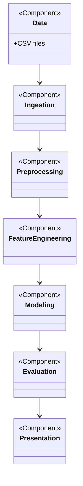

Final Project: Price Modeling & Forecasting
**Project Overview**

This repository contains the Final Project notebook and supporting assets for price modeling and forecasting. The primary deliverable is the Jupyter notebook `YD_3_11_2026_Final_Project.ipynb`, which documents the end-to-end workflow: data ingestion, cleaning, feature engineering, modeling, evaluation, and visualization.

**UML Diagram**



**Professional Summary — What I did**
- **Data ingestion & cleaning:** Loaded `prices_cache.csv`, handled missing values, and normalized data types.
- **Feature engineering:** created time-based, lag, rolling statistics, and categorical features to improve model performance (details below).
- **Exploratory analysis:** performed EDA with charts and summary statistics to validate assumptions.
- **Modeling & evaluation:** trained multiple models, compared metrics, and generated diagnostic plots; selected a final model and reported results.
- **Deliverables:** the notebook, slide deck in `presentation/`, and a presentation script in `department_speech_script.md`.

**Architecture — Pipeline & Components**

Overview of the analysis pipeline:
- **Data layer:** `prices_cache.csv` — source CSV file used for experiments.
- **Ingestion:** notebook cells read and version the raw data snapshot.
- **Preprocessing:** missing-value strategies, type conversion, outlier handling, and simple validation checks.
- **Feature engineering:** transformation steps that produce model-ready features (see next section).
- **Modeling layer:** train/validation/test splits, model training (baseline and advanced), hyperparameter tuning, and evaluation.
- **Evaluation & reporting:** metric tables, error analysis, and visualizations exported to the notebook and slides.

Architecture diagram (conceptual):

Data (CSV) -> Ingestion -> Preprocessing -> Feature Engineering -> Modeling -> Evaluation -> Presentation

**Feature Engineering — Methods & Examples**

Common feature types created in the notebook:
- **Time-based features:** `day_of_week`, `month`, `is_weekend`, `quarter`, `day_of_month`.
- **Lag features:** previous-period prices (t-1, t-7, etc.) to capture temporal dependencies.
- **Rolling statistics:** rolling mean, std, min/max over windows (e.g., 7-day, 30-day) to smooth noise.
- **Differencing:** first differences to stabilize trends and remove non-stationarity.
- **Categorical encoding:** one-hot or ordinal encoding for categorical fields when present.
- **Missing value handling:** forward/backward fill for time series gaps; median imputation for non-time features.
- **Scaling:** standardization or MinMax scaling before model fitting when required.

Example (conceptual) code snippets are included in the notebook demonstrating how these features were created and validated.

**Files**
- `YD_3_11_2026_Final_Project.ipynb`: Final project notebook (analysis, feature engineering, models, results).
- `prices_cache.csv`: Dataset used in the notebook.
- `presentation/`: Slide deck and presentation assets.
- `department_speech_script.md`: Speech/script for the presentation.
- `New folder/`: Miscellaneous or extra files.

**How to run the notebook locally**
1. Create and activate a virtual environment (Windows PowerShell):

```powershell
python -m venv .venv-1
.venv-1\\Scripts\\Activate.ps1
```

2. (Optional) Install the typical dependencies used in the notebook:

```powershell
pip install pandas numpy matplotlib scikit-learn jupyter
```

3. Start Jupyter and open the notebook:

```powershell
jupyter lab
```

**Notes & Next Steps**
- The notebook contains cell-by-cell explanations and results — refer to it for implementation details and experiments.
- I can extract the notebook imports to produce a `requirements.txt`, add a `Makefile` or `env` file, or create a short summary of each notebook section.

**References**

- **Dataset:** Yfinance.
- **Libraries & tools:** pandas, numpy, scikit-learn, matplotlib, JupyterLab, Git.
- **Books & guides:**
	- Hyndman, R.J. & Athanasopoulos, G., Forecasting: Principles and Practice (OTexts).
	- Box, G.E.P., Jenkins, G.M., Reinsel, G.C., Ljung, G.M., Time Series Analysis: Forecasting and Control.
Chaher Alzaman
    Department of Supply Chain and Business Technology Management, John Molson School of Business, MB 12-107, John Molson School of Business, Concordia University,
    1450 Guy, Montreal, QC, H3G-1M8, Canada
- **Selected papers:**
	- Hochreiter, S., & Schmidhuber, J. (1997). Long Short-Term Memory. Neural Computation.


